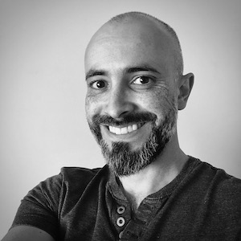

# About me
I'm a security engineer, passionate about software development with a strong focus on security and automation.

Programmatically solving problems is what I like to do best. Python is my primary language of choice and I'm a huge fan of its community and how it allows one to solve complex problems in a simple fashion.

Checkout my Github profile to see what I've been up to: https://github.com/agu3rra

 
