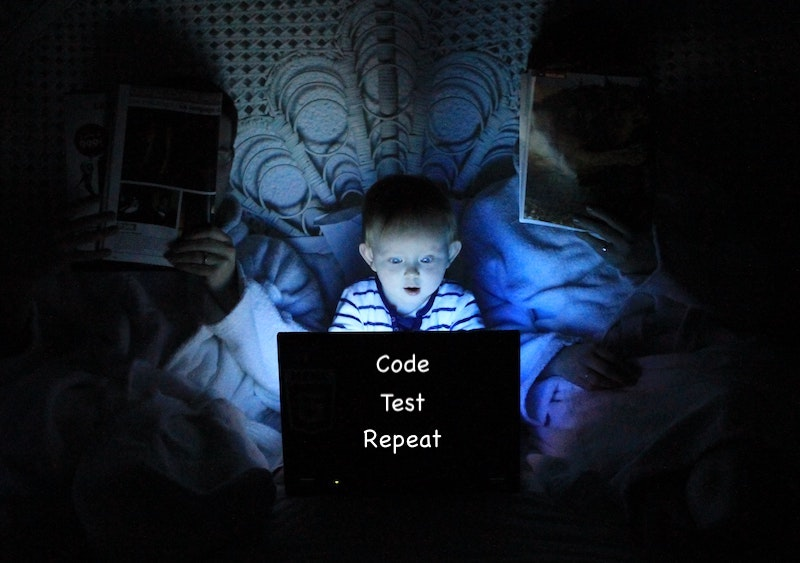

# Pragmatic Security Testing
8 min read

## Intro
It is a consensus in the software community that performing security testing continuously and earliest in the development process (aka shifting left) is ideal as it prevents vulnerabilities from creeping into code and therefore reduces the costs of having to fix them late in the process. This article seeks to provide an overview of different security scanners available and practical use strategies to establish a good development workflow.



Photo by <a href="https://unsplash.com/@ltoinel?utm_source=unsplash&utm_medium=referral&utm_content=creditCopyText">Ludovic Toinel</a> on <a href="https://unsplash.com/s/photos/child-computer?utm_source=unsplash&utm_medium=referral&utm_content=creditCopyText">Unsplash</a>

## Your precious armory

### SAST (Static Application Security Testing)
SAST tools are the ones that rely mainly on having access to an application's code and running a set of rule checks to detect vulnerable coding patterns or even code quality issues. There's a wide range to choose from open-source language-specific libraries and vendor applications that usually cover a wide range of programming languages. A comprehensive list of available tools is available on the [OWASP website](https://owasp.org/www-community/Source_Code_Analysis_Tools).

### SCA (Software Composition Analysis)
SCA tools can build a Software Bill of Materials (SBOM) by either looking at manifest files (`package.json`, `requirements.txt`, `go.mod`, `pom.xml`, etc.) or even at the final binary or container image of the software. These are usually employed to detect vulnerabilities in open-source libraries consumed by your application and are also capable of determining license risks associated with them when you're developing commercial software. Examples include [Snyk.io](http://Snyk.io), [Whitesource](https://www.whitesourcesoftware.com/), [Blackduck](https://www.blackducksoftware.com/), [Nexus Intelligence](https://www.sonatype.com/products/intelligence?hsLang=en-us), and [Docker SBOM](https://docs.docker.com/engine/sbom/) (experimental).

### DAST (Dynamic Application Security Testing)
DAST tools are point-n-shoot scanners that target a running application with a sequence of attacks and try to determine vulnerabilities based on the responses it gets. My personal experience with vendor tools in this area was that it would generally yield too many false positives when the scope of attacks was too broad. I  recommend their use for very specific tasks that leave little room for interpretation, like analyzing TLS cipher suites support and HTTP response headers for capturing misconfigurations. Due to its destructive nature on the target system, it's advised that a throwaway type testing environment be configured for such type of tool.

### IAST (Interactive Application Security Testing)
IAST tools also target a running system, but unlike DAST these usually have an agent providing instrumentation from within the target. Its goal is to enable more accurate results and overcome some of the limitations of SAST/DAST by combining both.

### Manual tools
Manual testing can take many forms. From the browser's built-in [Developer Tools](https://firefox-dev.tools/) to proxy applications that can monitor and manipulate HTTP traffic like [OWASP ZAP](https://www.zaproxy.org/) and [Portswigger's BURP](https://portswigger.net/burp), these usually require more in-depth knowledge of software security and are also more time-consuming to conduct. Tools in this category facilitate testing, but the ideas on what to do come from the person conducting them. Consistency is not something they can provide as results will vary with the experience of the pentester.

### Specific testing routines
As we learn the weak points of our application, we can also grow the number of unit or integration tests that comprise our regular testing suite to include security-specific scenarios. For instance, by providing a [SQL injection](https://portswigger.net/web-security/sql-injection) type input and evaluating if the application detects it and responds accordingly.

## Strategies

### IDE Linters
The best possible flow is the one that enables developers to take action without even having to leave their Integrated Development Environment ([IDE](https://en.wikipedia.org/wiki/Integrated_development_environment)). The scanner works almost like a virtual companion by providing issues and suggested fixes as code is written. You cannot shift any more left than this. As we’re in the realm of looking into code and providing insight **SAST and SCA tools may be capable of doing this**. In the Python world, I personally really like installing [bandit](https://pypi.org/project/bandit/) and enabling it as a linter in [VSCode](https://code.visualstudio.com) (*CTRL/CMD + SHIFT + P > Python: Select Linter*).

What I also like about tools like [bandit](https://pypi.org/project/bandit/) and [hadolint](https://github.com/hadolint/hadolint) (the latter scans Dockerfiles) is the fact that triages can be provided as code. From an audibility perspective that’s great given source control is able to track who did what and when.

```python
import yaml

yaml_file = "some_path_provided_by_the_user.yaml"
with open(yaml_file, 'r') as fh:
    my_yaml = fh.read()
foo = yaml.load(my_yaml)  # nosec Bandit B506: user input has been previously sanitized.
```

*Example of a triaged vulnerability in python code using [bandit](https://pypi.org/project/bandit/). B506 highlights that the load() method in the [pyyaml](https://pypi.org/project/PyYAML/) library is vulnerable when consuming user-provided input. Adding `# nosec` as part of the comment, informs the scanner that the issue is to be ignored.*

??? question "What is triaging?"
    That’s when a human assesses an issue to determine whether it is exploitable or not. In case there are possible mitigations these can be applied and provided to explain why a reported vulnerability is being dismissed in a scan report.

### Pull requests (PR’s)
Once code is committed and pushed to source control (e.g.: [GIT](https://git-scm.com/), [Mercurial](https://www.mercurial-scm.org/)), continuous integration tools (e.g.: [Jenkins](https://www.jenkins.io/), [GitHub Actions](https://github.com/features/actions), [Azure DevOps](https://azure.microsoft.com/en-us/services/devops/), [CircleC](https://circleci.com/)I, [Travis](https://travis-ci.org/) etc) can execute not only the usual testing, build, deploy and release routines but also include security testing.

Triggering a security scan on every PR ensures issues can be viewed and addressed even before changes are merged into the `trunk/main`branch. By opting to break the CICD process in case of issues, you are almost 100% certain to get developers' attention while also ensuring important branches of the code are kept clean.

The feasibility of this approach depends on how long the scans take to complete. If the CICD process takes about 15 minutes in total, it makes no sense to trigger a SAST scan that takes about an hour to complete as it’d be too big of an impact on developer productivity. An option, in this case, is to enable what is known as a differential or incremental scan which focuses only on lines of code that are introduced by the PR. The caveat is to assign someone in the team who will ensure full scans are regularly executed and reviewed.

Candidate scanners here would include SAST and SCA (manifest-based) on pre-build stages of the CI. Post-build scans could include SCA (binary/image-based) and even DAST/IAST considering a testing environment can be auto-provisioned.

### On merge to `trunk/main` branch
When scans take too long to finish or the number of developers working on the code concurrently is too high a good balanced approach is to configure them to trigger on commits to `trunk/main` branch. 

The drawback here is that security issues are only detected after changes on PR’s are reviewed and merged. So the fix-flow involves submitting a new PR and going thru a review process once issues are addressed.

The same scanners applicable in the PR strategy (above) can also be used here.

### On a scheduled routine ([CRON](https://en.wikipedia.org/wiki/Cron) job)
The last option is to put all the scans to run on a schedule (once a day, a week, etc). Visibility is the major concern in this type of strategy given that scheduled jobs can often go unnoticed by the development team and issues remain unaddressed. Additionally, this option tends to cause issues to accumulate until someone decides to do something about them. Like in the previous section, all scanners but the manual type can be employed.

## Closing remarks
It’s important to note that there’s no silver bullet when it comes to security scanning. Each strategy has its pros and cons and feasibility also depends on the workflow of the development team. The main goal is to strive for a balance that enables thoroughness while keeping productivity high.

!!! danger "What if triaging conditions change?"
    A common scenario when triaging open-source software libraries is to dismiss a vulnerability when the exploitability conditions are not met. If a vulnerable method is not used, then your code is safe. But consider for a moment that a software project is ever-evolving and that teams change. In the future, a new team member may introduce that specific method that is vulnerable therefore putting the project at risk. 

    This is one of the reasons why it’s always a good idea to patch open-source dependencies regularly. As new vulnerabilities come out and the community works on providing fixes, you’re automatically incorporating them into your project.

    Another good idea is to establish a regular review process of all triaged issues to ensure mitigation conditions are still met.