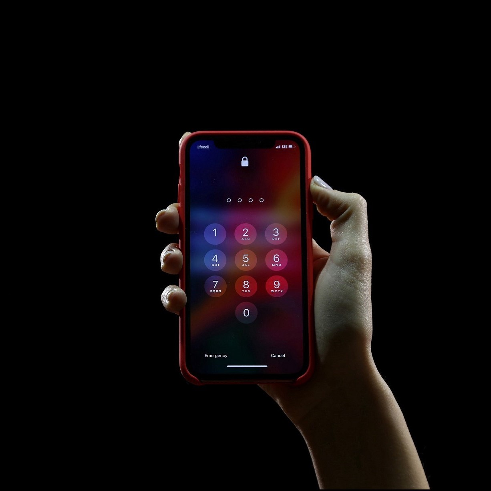
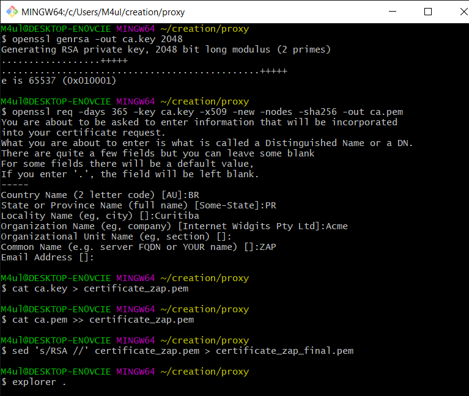
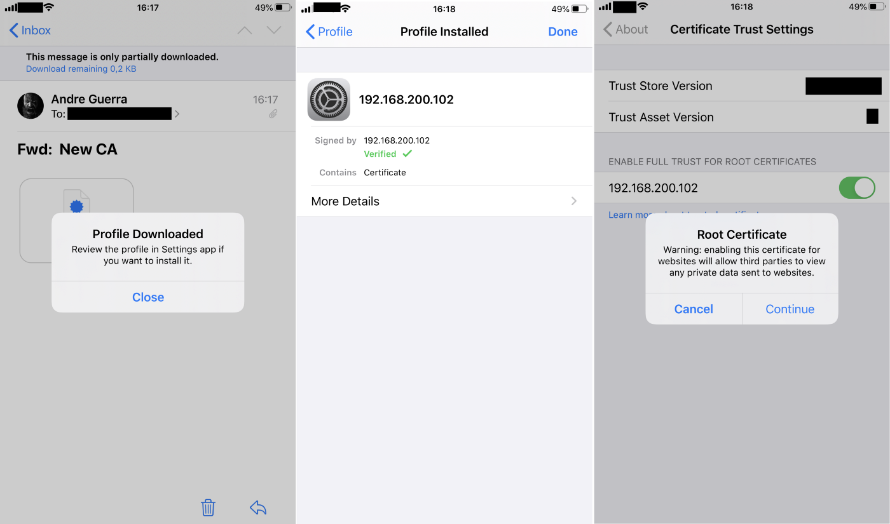
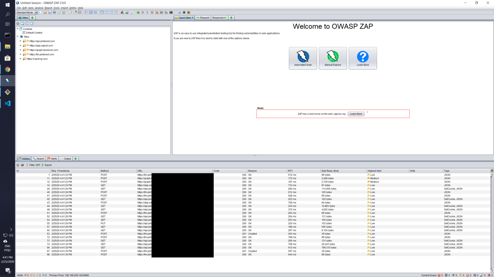

# How to set up a proxy for security testing in iOS13

Reading time: about 4 minutes.

So you want to hunt for bugs in Bug Bounty programs that allow testing of iOS applications, but couldn’t figure out how to take a pick on traffic coming out of your device? You’ve come to the right place! :)

!!! warning "DISCLAIMER"
    Beware that testing any systems without proper authorization is illegal. I trust you will use the information contained in this article appropriately.

!!! info
    At the time I wrote this article (in late 2021?), some proxy applications' default generated certificate was not accepted by iOS 13. That has now changed, but I decided to keep this article up since it teaches how to generate a certificate yourself in case you need it for other situations.


*Photo by [Yura Fresh](https://unsplash.com/@mr_fresh?utm_source=unsplash&utm_medium=referral&utm_content=creditCopyText) on [Unsplash](https://unsplash.com)*

## iOS 13’s new certificate requirements
The security requirements around certificates have been a bit [tightened](https://support.apple.com/en-us/HT210176) on iOS13. In this article, I will walk you through how to generate a certificate that is accepted in devices with the latest iOS update and how/where to configure it. This should enable you to pick on HTTPS traffic in and out of apps in Apple’s ecosystem.

!!! info "Update"
    Default certificates bundled with security testing tools such as [OWASP Zed Attack Proxy](https://owasp.org/www-project-zap/) (aka. ZAP) or [BURP](https://portswigger.net/burp) did not adhere to these standards shortly after iOS 13 was launched. They do now, so you can simply use the certificate generated by these tools and import them into iOS using steps 3 and 4 described here. I’ll keep this article published for reference in case something similar happens in a future iOS release.
    
    *Thank you to the folks who brought this to my attention! :)*

## What we are aiming to achieve
A configuration setup that will redirect any communication traffic from an iOS13 device to a personal computer before reaching application servers that enable any given iOS app to work:

> iOS device ← → Computer with ZAP ← → Application Servers

I am assuming your local network has internet connectivity and that your iOS and computer are in the same network.

## Required steps
1. Generate a self-signed certificate
1. Import the certificate to your proxy tool (we’ll use ZAP).
1. Import the same certificate into iOS’ certificate store and have it enabled as trusted.
1. Manually override your iOS’ network settings to proxy traffic to your computer.

If all works out, you should be able to see all HTTPS traffic that flows while you use apps on your iOS device.

---

## Detailed steps

### Generating a self-signed certificate
I am working on a Windows PC and I have previously installed [GIT for Windows](https://git-scm.com/downloads) which enables me to run the following openssl commands from Git Bash to get myself a self-signed certificate.

```bash
$ openssl genrsa -out ca.key 2048
$ openssl req -days 365\
              -key ca.key\
              -x509 -new -nodes -sha256 
              -out ca.pem
$ cat ca.key > certificate_zap.pem
$ cat ca.pem >> certificate_zap.pem
$ sed 's/RSA //' certificate_zap.pem > certificate_zap_final.pem
```


*Generating certificate from git bash*

### Importing it into ZAP
Use the `certificate_zap_final.pem` file generated in the previous step as the certificate that is presented by your proxy to iOS. For that, launch ZAP (2.9.0 at the time of this writing), find the **Tools > Options > Dynamic SSL Certificates** menu, and use the **Import** button.

!!! note
    1. ZAP requires the private key and the certificate to be in the same file. Additionally, it also asks that the private key part be in an exact format, which is the reason why I had to run the cat and sed commands in the previous step.
    2. If you want to use BURP instead of ZAP, the following command generates a PKCS#12 keystore to import the certificate into it:

    > $ openssl pkcs12 -export -out burpcert.pfx -inkey ca.key -in ca.pem

### Importing the certificate into iOS
Email the `ca.pem` file generated previously to your iOS device. Opening it on Apple’s **Mail app** is the easiest way to get it installed into your device as what is called a **Profile**. In iOS, simply click the ca.pem file inside the Mail app to download the new Profile. Then go to the **Settings > General > Profile** menu and complete the installation of the certificate. Finally, go to **Settings > General > About > Certificate Trust Settings** and enable full trust of the certificate.


*Reference screenshots from an iOS device*

### Redirecting traffic
Access **Settings > Wi-Fi**, click the info sign beside your Wi-Fi network and access the **Configure Proxy** session. Select **Manual** and specify the IP address of your computer as the server and the proxy port you’re using in ZAP to serve it as a proxy (default is 8080).

## Congratulations!
And you’re done! If you launch any application on your iOS device now, all HTTP traffic should be visible in ZAP.


*Sample traffic upon opening Pinterest on iOS*

## References
* https://support.apple.com/en-us/HT210176
* https://owasp.org/www-project-zap/
* https://portswigger.net/burp