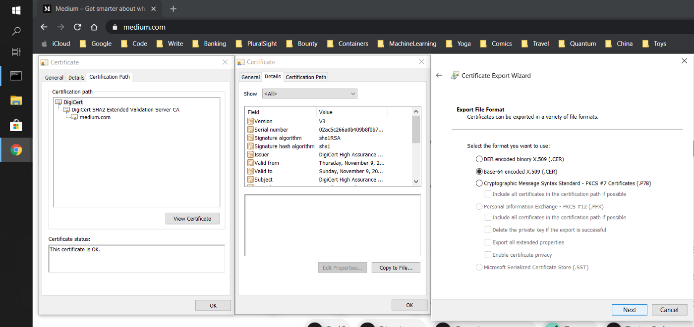
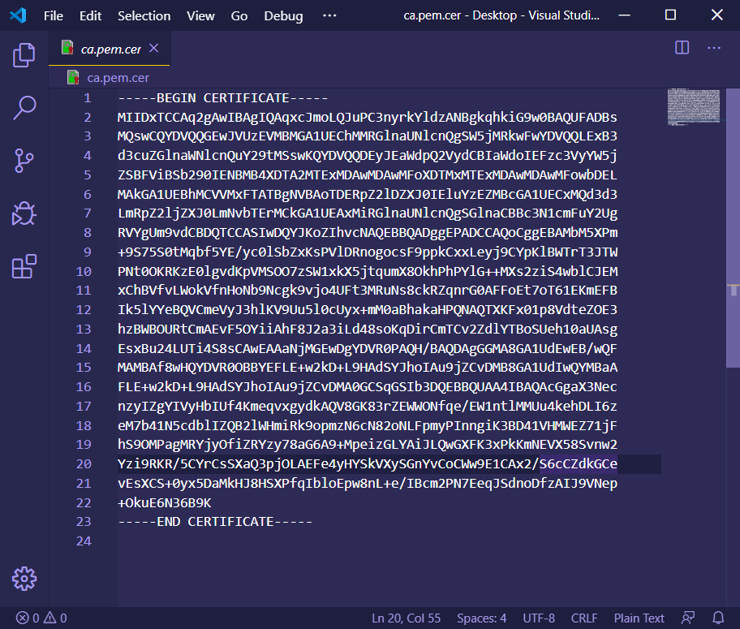

# Trouble using Python to access HTTP corporate services because of internal CA’s?

Reading time: About 3 minutes

## The problem
If you have used any of Python’s HTTP libraries such as [requests](https://pypi.org/project/requests/) or [urllib](https://docs.python.org/3/library/urllib.html) you may have stumbled upon the **CERTIFICATE_VERIFY_FAILED error**. One of the possible causes is the service you are connecting to uses either a certificate that was self-signed or issued by a [Certificate Authority (CA)](https://en.wikipedia.org/wiki/Certificate_authority) that is not publicly recognized. The latter is very common in corporate intranet services, so if you’re building an application to talk to these you must “tell” Python that its CA is trusted.

!!! info
    PS: I did the following with Python 3

  
*Photo by [Scott Warman](https://unsplash.com/@scottiewarman?utm_source=unsplash&utm_medium=referral&utm_content=creditCopyText) on [Unsplash](https://unsplash.com)*

## Why does it happen?
Python scripts don’t use the operating system’s built-in certificate store to establish trust when securing channels to services it wishes to communicate with. These are kept in a file called `cacert.pem`, inside the install path of the `certifi package`. All you have to do is import (copy/paste) the CA or self-signed certificate to that file and you should be able to connect to a service that makes use of it.

## Who do you trust?
Your computer’s operating system comes pre-loaded with a list of public known CA’s (e.g.: DigiCert, GoDaddy etc) so that a website served using HTTPS can be accessed. The catch is: there are lots of different places that a given program may be using as its source of trusted CA’s.

!!! tip
    If you wish to know more about a CA and how that trust relationship works and most importantly the **implications of adding another CA to your trust store**, try reading [this article](tlsHandshake.md).

## Where does Python keep its CA’s?
In the `cacert.pem` file. To locate it, all you have to do is find the install path of Python’s standard `certifi` package. The easiest route I know for that is simply opening a Python [REPL](https://en.wikipedia.org/wiki/Read–eval–print_loop) (`$ python`) and typing the following:

```bash
$ python
>>> import certifi
>>> path = certifi.__path__[0]
>>> print(path)
```

  
*Where is cacert.pem?*

## Ok, I found certifi’s path. Now what?
Append the [Base64](https://en.wikipedia.org/wiki/Base64) encoded certificate data to it. This does look like a bit of a mouthful, but it is quite simple. Base64 encoding is simply a sequence of characters that represents all of the certificate’s information. As an example, I’m going to save Medium’s CA in that format by executing the following steps:

1. Access the site or service you with to communicate to.
1. Click the padlock icon, then on the certificate to view it.
1. Access the **Certification Path**, select the certificate that you wish to save then **View Certificate**.
1. Access the **Details tab** and finally **Copy to File**.
1. Open the certificate file and copy its contents to the `cacert.pem` file.

  
*Saving a certificate’s CA from the browser*

  
*Opening a certificate’s CA in Base64 format using [VSCode](https://code.visualstudio.com/)*

## Try it yourself
You should now be able to copy the contents of the PEM file obtained above into the `cacert.pem` file that Python uses. Then your Python libraries should be able to call services that were signed by the custom CA or self-signed certificate.

If you found any errors or have anything you’d like to see added to this article, please feel free to message me on [Twitter](https://twitter.com/agu3rra).

Thanks for reading!
