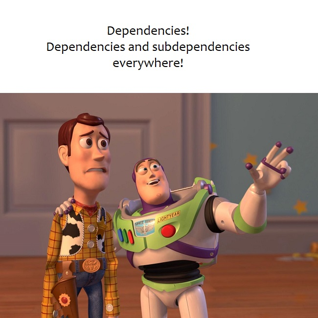

# Tackling vulnerabilities in open-source
5 min read

So you’re keeping track of all the open-source dependencies (aka libraries) in your software and you found a vulnerability. Well... consider yourself lucky, because I usually find a whole bunch of them! Jokes aside, this article will talk about the possible ways of dealing with it.


Photo by [Katrina Berban](https://unsplash.com/photos/k24k1INxuxk) on Unsplash.

## Direct Vs. Transitive dependencies
The different possible dependency paths a vulnerability comes from play a role in the difficulty level of how to treat it. Direct dependencies are those that you explicitly add to your code. Since software is commonly built on top of pre-existing software, libraries you pull directly will often have direct dependencies of their own. These will be considered transitive or indirect dependencies and they can be nested several levels down the supply chain as even your indirect dependencies can have dependencies of their own.

!!! warning
    Manifest files containing [semver](https://semver.org/) (semantic versioning) do not tell you the actual library version you consume. If you want to double-check check in the code, refer to lock files (e.g.: `package-lock.json`, `Pipfile.lock`, `go.sum` etc). Different package management systems may allow multiple versions of the same library to be consumed. Some will also allow you to force specific versions of a library despite the main dependency manifest requiring a different version.

## What is a CVE?
The mission of the [CVE® Program](https://cve.mitre.org/) is to identify, define, and catalog publicly disclosed cybersecurity vulnerabilities. A CVE (Common Vulnerabilities and Exposures) is basically **a unique identifier for a security vulnerability in a piece of software**. The CVE program is funded by the [U.S. Department of Homeland Security](https://www.dhs.gov/). An extended technical description of the vulnerabilities, attack vectors, additional links, and severity score (scale from 0 to 10) are all maintained at the [National Vulnerability Database (NVD)](https://nvd.nist.gov/). 


*In the example CVE record above taken from the NVD for the `pandas` library, you can find information such as the severity score and different factors that contributed to it. Additionally, you can observe that versions above 1.0.3 are not affected by it and also that the vulnerable method is `read_pickle()`.*

## The 3 alternatives to deal with vulnerable libraries

### 1. Remove

Perhaps the library for which you got a vulnerability report in your software was just there for testing purposes and you actually don’t even use it. So **simply remove it**. Less is more when it comes to managing dependencies in software.

### 2. Patch

Sometimes a patch is already available by the time you detect a vulnerability. In the previous example for the `pandas` library ([CVE-2020-13091](https://nvd.nist.gov/vuln/detail/CVE-2020-13091)) a patch to any version above 1.0.3 would fix it. When a **patch is not available** for a piece of open-source software you use, you can always work on a **fix yourself and contribute back to the community** by making something you rely on more secure.

Fixing yourself obviously involves more work and to illustrate how direct vs. transitive dependencies play a role in this, let’s use an example. The output below was obtained after installing 3 separate python libraries (direct dependencies) via [pipenv](https://pipenv.pypa.io/en/latest/) and running the `pipenv graph` command:

```toml
pandas==1.4.2
  - numpy [required: >=1.21.0, installed: 1.22.3]
  - python-dateutil [required: >=2.8.1, installed: 2.8.2]
    - six [required: >=1.5, installed: 1.16.0]
  - pytz [required: >=2020.1, installed: 2022.1]
pytest==7.1.2
  - atomicwrites [required: >=1.0, installed: 1.4.0]
  - attrs [required: >=19.2.0, installed: 21.4.0]
  - colorama [required: Any, installed: 0.4.4]
  - iniconfig [required: Any, installed: 1.1.1]
  - packaging [required: Any, installed: 21.3]
    - pyparsing [required: >=2.0.2,!=3.0.5, installed: 3.0.8]
  - pluggy [required: >=0.12,<2.0, installed: 1.0.0]
  - py [required: >=1.8.2, installed: 1.11.0]
  - tomli [required: >=1.0.0, installed: 2.0.1]
requests==2.27.1
  - certifi [required: >=2017.4.17, installed: 2021.10.8]
  - charset-normalizer [required: ~=2.0.0, installed: 2.0.12]
  - idna [required: >=2.5,<4, installed: 3.3]
  - urllib3 [required: >=1.21.1,<1.27, installed: 1.26.9]
```

If we identify a vulnerability in `six 1.16.0`, that needs patching, the community mindset of open-source would tell us to provide a fix to that library (generating version 1.16.1) then have the `python-dateutil` library consume it (generating version 2.8.3) and finally do the same for `pandas` so we could finally consume a patched version (`pandas 1.4.3`). That’s a lot of effort since the vulnerability path was 2 levels down in our transitive dependencies (`packaging` and `pyparsing`).



### 3. Mitigate
It is also possible that the vulnerability has a mitigation factor in place. There can be other conditions that lessen the overall severity and you decide the risk level is acceptable. I particularly find [NVD’s CVSS (Common Vulnerability Scoring System) calculator](https://nvd.nist.gov/vuln-metrics/cvss/v3-calculator) useful for getting a personalized assessment and severity score depending on how a particular vulnerability can be exploited. For example: the CVE record score states that no privileges are required (PR:N), but you know for a fact that the library can only be reached once a user has gotten past the login screen of your application, so you can use PR:L (low privilege required) to get an updated score for your particular case.

And finally, perhaps the exploit condition is not met and the vulnerability cannot be exploited in your software. Going back to the `pandas` example ([CVE-2020-13091](https://nvd.nist.gov/vuln/detail/CVE-2020-13091)), remember that the CVE entry described that the vulnerable method was `read_pickle()`. So, if you know you’re not calling it anywhere in code, then it should not affect you. A caveat with that is when you’re talking about vulnerabilities in transitive dependencies as it can become difficult to determine if somewhere in your dependency tree calls to that specific method are made indirectly.

!!! warning "What if the conditions change?"
    Another important factor to consider is that a method that is not used today may be invoked in the future as your software evolves. Once a vulnerability is dismissed, you may re-introduce it depending on what tool you used to detect it (see post on security scanners). So the best alternative to play it safe is to ensure regular patching is part of your development process.

## References

1. [https://www.redhat.com/en/topics/security/what-is-cve](https://www.redhat.com/en/topics/security/what-is-cve)
2. [https://www.dhs.gov/](https://www.dhs.gov/)
3. [https://nvd.nist.gov](https://nvd.nist.gov/)
4. [https://cve.mitre.org](https://cve.mitre.org/)
5. [https://nvd.nist.gov/vuln-metrics/cvss/v3-calculator](https://nvd.nist.gov/vuln-metrics/cvss/v3-calculator)
