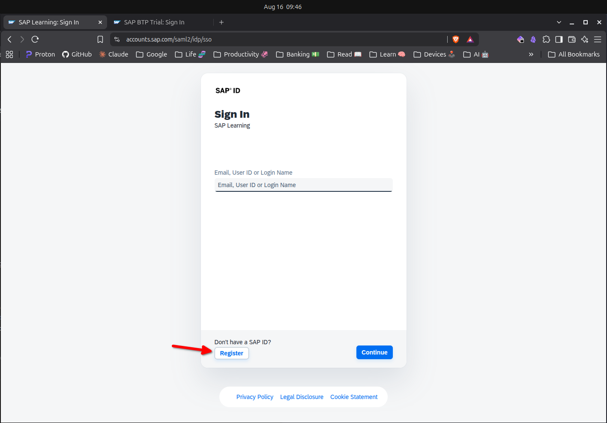
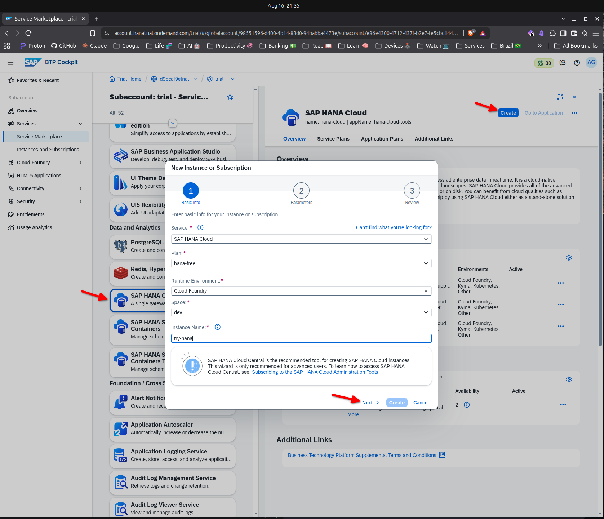
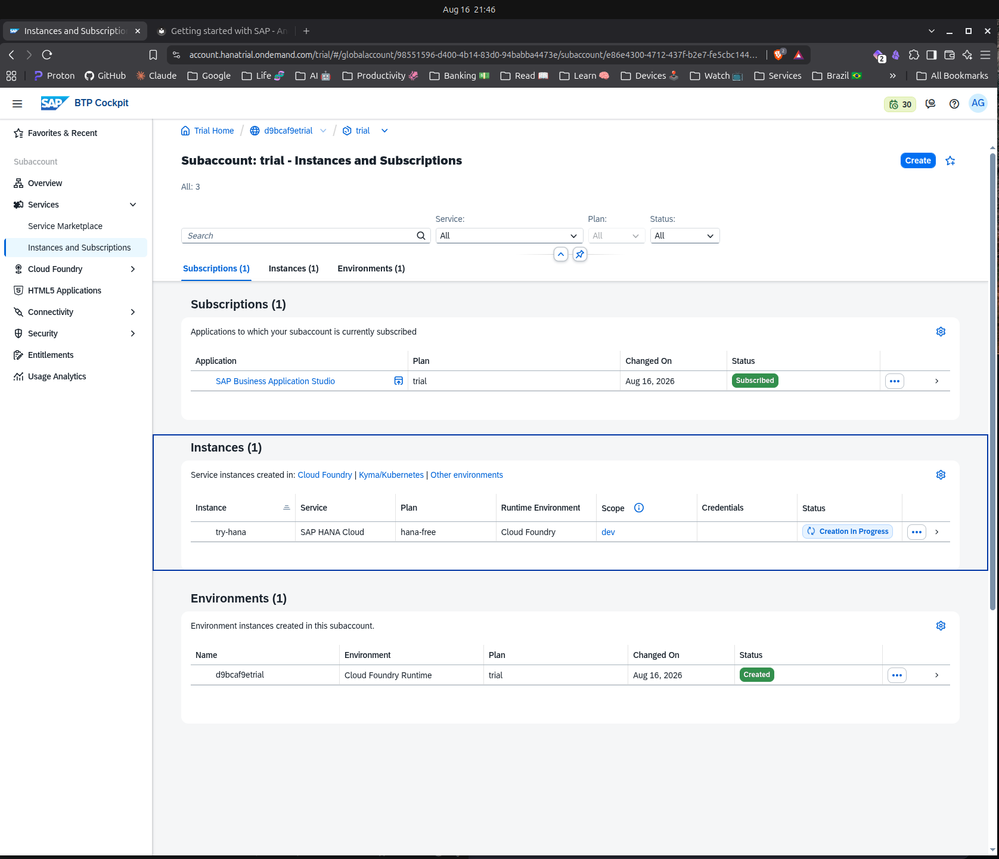
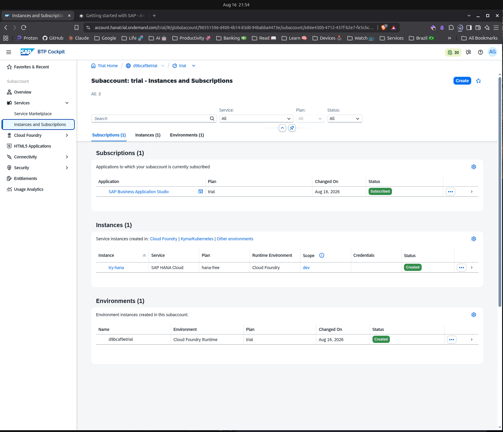
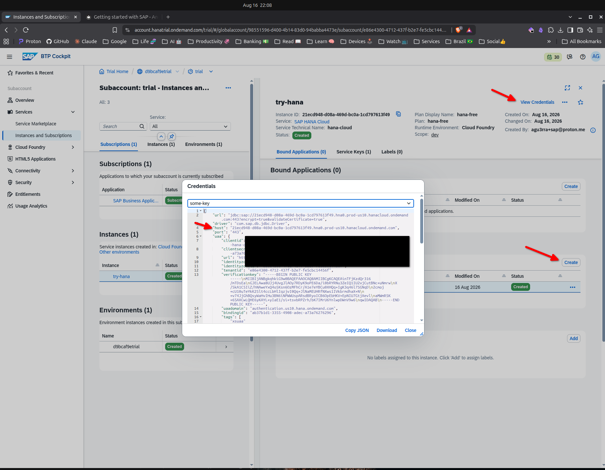
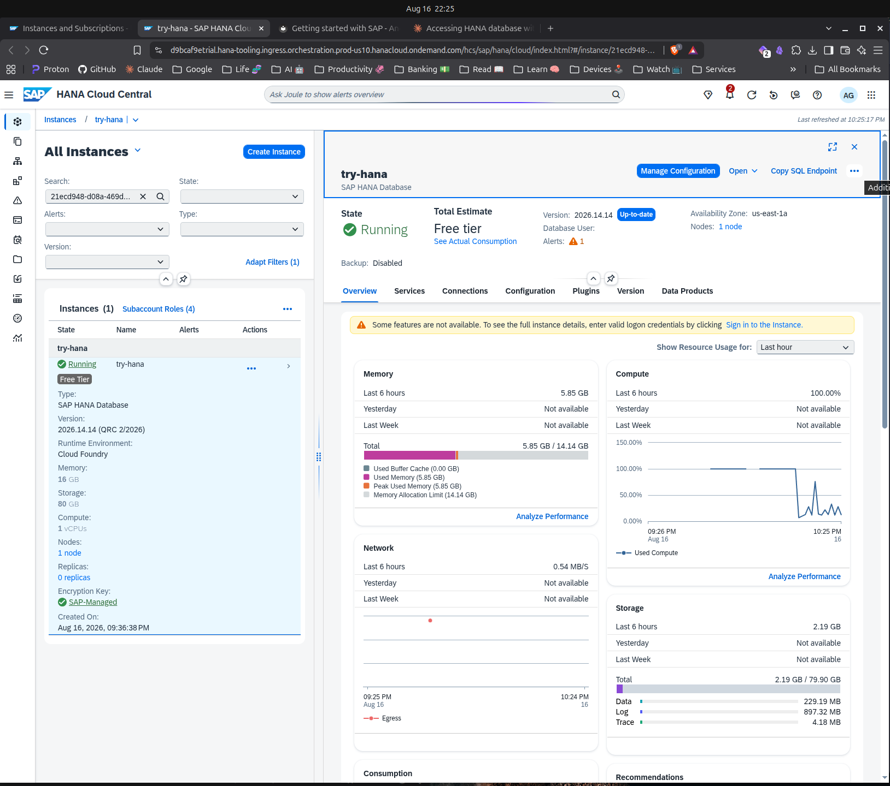
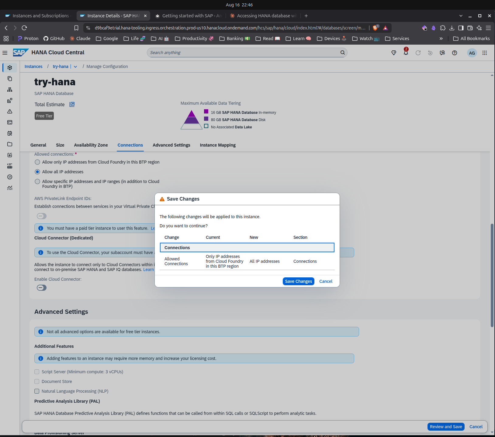

# Getting started with SAP

!!! abstract "First published: 2026-08-16"

This post covers a brief introduction to what SAP is and how to begin getting hands-on practice with its technology free of charge.

## What is SAP?

SAP SE is a German multinational software corporation that develops enterprise software to manage business operations and customer relations. Founded in 1972 by five former IBM engineers in Weinheim, Germany. Since that's perhaps too much of a mouthful to remember, here's a more memorable version of it:

!!! quote "The biggest software company you have never heard of."
    The actual numbers vary according per source, but more than 70% of global transaction revenue touches an SAP system at some point.

    <iframe width="560" height="315" src="https://www.youtube.com/embed/YyDM3LajCog?si=JKE-5G4_gXRsxn-c" title="YouTube video player" frameborder="0" allow="accelerometer; autoplay; clipboard-write; encrypted-media; gyroscope; picture-in-picture; web-share" referrerpolicy="strict-origin-when-cross-origin" allowfullscreen></iframe>

## In the before times
Back when I first started working with SAP ERP systems ([back in 2009](https://www.linkedin.com/in/agu3rra/)), there were one of 2 ways you'd be able to learn anyting related to SAP: either you'd get lucky (like I did) and get hired by a company that had it and would teach you what it was and how it worked OR you'd self-sponsor some set of expensive certifications that would do the same.

Fortunately, a lot has changed since then and today, anyone with a regular computer and a cell phone is able to provision not only SAP's famous ERP system based on ABAP, but also its many different cloud offerings via SAP BTP.

The first step on this journey is getting yourself an SAP Account, and that's what we'll cover next.

## SAP Universal ID

!!! quote "SAP Universal ID is your personal, permanent digital identity for the entire SAP ecosystem."

Think of it as a single account that stays with you throughout your career, regardless of which company you work for or which SAP products you use.

It acts as a central wallet that ties together all your SAP user identities (such as S-users or P-users), preserves your learning certificates, community badges, and professional achievements, and gives you one place to manage them all in the SAP Universal ID account manager.

**Unlike a company account that you might lose when you change jobs, your SAP Universal ID is personal and belongs to you alone.**

> source: https://www.sap.com/account/universal-id.html

??? question "How does one link SAP accounts?"
    Your email address is the primary association key: Instead of manually linking accounts.
    All SAP user accounts that use the same email address will automatically be associated

#### Creating an SAP ID

Access [SAP Learning Login](https://learning.sap.com/?userlogin=true) and register for a new account.

??? question "What is SAP Learning?"
    SAP Learning is SAP’s learning ecosystem for building SAP skills through self-paced content, premium learning, live sessions, hands-on practice, and certification preparation. It includes resources for individuals and organizations, with options aimed at both free learning and subscription-based upskilling. More at https://learning.sap.com.

=== "Registration" 
    

=== "Confirmation message"
    

=== "Confirmed"
    

Accessing SAP BTP does not require an SAP Universal ID (sorry), but you can **optionally** upgrade the account you have just created to one at https://account.sap.com/sam/my-account once you complete this step.

## SAP Business Technology Platform
SAP BTP is SAP’s cloud platform for building, extending, integrating, automating, and analyzing business applications and processes.

## Creating a BTP Trial environment
Access [SAP BTP Trial](https://account.hanatrial.ondemand.com/trial/#/home/trial).
Complete an account upgrade process by informing your phone and confirming the SMS code you'll receive.
Then, on the next page, select one of the available options for region and wait for provision to finish.

Once that happens, you should be able to see the main global account menu, then access the corresponding `trial` subaccount you've just provisioned.

??? info "Global vs. Subaccounts"
    - a **global account** is the top-level container that represents your contract with SAP and holds the entitlements, quotas, members, and subaccounts for your organization.
    - a **subaccount** is a child environment inside that global account where you actually deploy apps, use services, and manage subscriptions.

=== "Region selection"
    
    
=== "Provisioning"
    

=== "Trial account"
    

=== "Subaccount"
    

!!! warning "How long do I have it for?"
    A trial account is valid for up to 90 days before your playground is destroyed.
    During that time, you can select a limited (but meaningful) variety of SAP products and services to provision and learn through hand-on practice.
    After that period you can create a brand new environment from scratch if you want to keep at it.

## Provisioning an SAP HANA DB

### Instance provisioning
By default, your trial account comes with a Cloud Foundry environment enabled, which we'll use via SAP BTP Cockpit to provision and access an SAP Service.

??? question "What is Cloud Foundry?"
    Cloud Foundry is an open-source Platform as a Service (PaaS) for deploying, running, scaling, and managing applications without requiring developers to manually manage servers, operating systems, networking, or much of the application runtime. It supports multiple cloud providers, programming languages, and external services.

    > reference: https://docs.cloudfoundry.org

From the **Service Marketplace** menu, weĺl select **[SAP HANA Cloud](https://www.sap.com/products/data-cloud/hana.html)** and use the Cockpit UI to provision a working version of SAP's famous in-memory database. The menu requires you to provide an initial system password and I recommend you use a password manager for that (i.e.: [ProtonPass](https://proton.me/pass), [BitWarden](https://bitwarden.com/)). Once you finish going through the creation menu, wait for instance creation to complete.

=== "Marketplace"
    

=== "HANA Cloud"
    

=== "Creation in Progress"
    

=== "Creation Completed"
    

### HDBSQL CLI

HANA Databases can be accessed via the `hdbsql` CLI tool. On Linux, it can be installed by retrieving it from https://tools.hana.ondemand.com/#hanatools and following install instructions. The gist of it is: run `./hdbinst` from the extracted tar and add the target install folder to `$PATH`. Confirm you have it by running `hdbsql --version`.

!!! note "I'll skip any detailed instructions on the CLI install, since the focus of this post is on how to provision a working SAP service from BTP and not the service itself."

In this example, by generating a service-key, I see our HANA DB host is `21ecd948-d08a-469d-bc0a-1cd797613f49.hna0.prod-us10.hanacloud.ondemand.com`, running on port `443`.

=== "Install"
    ```
    agu3rra@ava:~/Downloads/bin/hanaclient-latest-linux-x64/client$ ./hdbinst 
    SAP HANA Database Client installation kit detected.


    SAP HANA Lifecycle Management - Client Installation 2.29.25.1782850996
    **********************************************************************


    Enter Installation Path [/home/agu3rra/sap/hdbclient]: 
    Checking installation...
    Preparing package 'Product Manifest'...
    Preparing package 'SQLDBC'...
    Preparing package 'REPOTOOLS'...
    Preparing package 'Python DB API'...
    Preparing package 'Python Machine Learning Client'...
    Preparing package 'ODBC'...
    Preparing package 'R Machine Learning Client'...
    Preparing package 'JDBC'...
    Preparing package 'HALM Client'...
    Preparing package 'DBCAPI'...
    Preparing package 'node.js Client'...
    Preparing package 'golang Client'...
    Preparing package 'Ruby Client'...
    Preparing package 'Code Examples'...
    Preparing package '.NET Core'...
    Preparing package 'Environment Script'...
    Preparing package 'Client Installer'...
    Installing SAP HANA Database Client to /home/agu3rra/sap/hdbclient...
    Installing package 'Product Manifest'...
    Installing package 'SQLDBC'...
    Installing package 'REPOTOOLS'...
    Installing package 'Python DB API'...
    Installing package 'Python Machine Learning Client'...
    Installing package 'ODBC'...
    Installing package 'R Machine Learning Client'...
    Installing package 'JDBC'...
    Installing package 'HALM Client'...
    Installing package 'DBCAPI'...
    Installing package 'node.js Client'...
    Installing package 'golang Client'...
    Installing package 'Ruby Client'...
    Installing package 'Code Examples'...
    Installing package '.NET Core'...
    Installing package 'Environment Script'...
    Installing package 'Client Installer'...
    Installation done
    Log file written to '/var/tmp/hdb_client_2026-08-16_22.01.33_13763/hdbinst_client.log' on host 'ava'.
    ```
=== "Version check"
    ```
    agu3rra@ava:~$ hdbsql --version
    HDBSQL version 2.29.25, the SAP HANA Database interactive terminal

    Usage:
    hdbsql [<options>] [<command>]

    Options for connecting to the database:
    -i <instance number>    instance number of the database engine
    -n <server>[:<port>]    name of the host on which the database instance is
                            installed (default: localhost:30015)
    -d <database_name>      name of the database to connect
    -u <user_name>          user name to connect
    -p <password>           password to connect
    -U <user_store_key>     use credentials from user store
    -e                      encrypt communication
    -attemptencrypt         attempt encrypt communication, fall back to
                            unencrypted on failure
    -z                      switches autocommit off
    -Z <property>=<value>   sets SQLDBC connect options e.g. -Z sqlMode=SAPR3
    -r                      suppress usage of prepared statements

    Input and output options:
    -I <file_name>          use file <file_name> to input queries
                            (default: stdin)
                            use a separator (default: ';') to separate
                            individual commands in the file
                            (e.g. SELECT 1 FROM dummy;\sstats;)
    -V (<var1>|<var_name1>=<value>),...,(<varN>|<var_nameN>=<value>)
                            specify variable values to use in sql script.
                            <var1> specifies values for position variables
                            (e.g. &1), <var_name1>=<value> specifies values for
                            named variables (e.g. &test)
    -o <file_name>          use file <file_name> for output (default: stdout)
    -O <file_name>          same as -o, except append to file <file_name> if it
                            already exists
    -m                      activates the multi-line mode for query input
    -B <encoding>           force input encoding, one of "UCS2BE", "UCS2LE"
                            or "UTF8" (UTF8 is default)
    -resultencoding <encoding> force output encoding, one of "UTF8", "LATIN1"
                            or "AUTO" (AUTO is default) for result data
    -quiet                  Do not print the welcome screen

    Output format options:
    -j                      switch the page by page scroll output off
    -Q                      show each column on a separate line
    -f                      printout the SQL commands
    -fn                     printout the SQL commands with additional line
                            numbering
    -b MAXLENGTH            maximum output length for binary and long columns in
                            bytes/characters (default is 32)

    General options:
    -h                      show help for common options, then exit
    -h2                     show help for all options, then exit
    -v                      printout version information
    -optionsfile <filename> load options from a file
    -stdin                  load more options from stdin

    For further information, type "\?" (for internal commands) from within
    HDBSQL or consult the HDBSQL documentation.
    ```

=== "Service key"
    

### Allow listing
By default, does not allow inbound connections from the internet, so the next step is to add your computer's IP address to an allow list. For that we need to enable the **SAP HANA Cloud > Tools** plan on BTP. Create it in the **Instances and Subscriptions** menu and wait for provisioning to complete. Complete instructions at [Subscribing to the SAP HANA Cloud Administration Tools](https://help.sap.com/docs/hana-cloud/sap-hana-cloud-administration-guide/subscribing-to-sap-hana-cloud-administration-tools).

Once you assign the correct **Role Collections** in BTP, then clicking the HANA instance should take you to **HANA Cloud Central**. Once in there, access the **Manage Configuration** menu and add *Allow all IP addresses*. Wait for the configuration details to refresh, then attempt to connect using `hdbsql` with user account `DBADMIN` and the password you've configured when provisioning. You should now be able to run SQL queries against your very first HANA Database.

=== "HANA Cloud Central"
    
=== "Allow listing"
    
=== "HDBSQL access"
    ```
    agu3rra@ava:~/dev$ hdbsql -n 21ecd948-d08a-469d-bc0a-1cd797613f49.hna0.prod-us10.hanacloud.ondemand.com:443 -u DBADMIN -p $HDBPASS

    Welcome to the SAP HANA Database interactive terminal.
                                            
    Type:  \h for help with commands          
        \q to quit                         

    hdbsql H00=> SELECT CURRENT_USER, CURRENT_SCHEMA FROM DUMMY;
    CURRENT_USER,CURRENT_SCHEMA
    "DBADMIN","DBADMIN"
    1 row selected (overall time 140.313 msec; server time 473 usec)

    hdbsql H00=>
    ```

## Until next time
We've covered a lot of ground, from a brief intro to the SAP world to how anyone can get their feet wet with SAP software without having to spend out of pocket money.
I hope you liked this introduction.
Until next time.