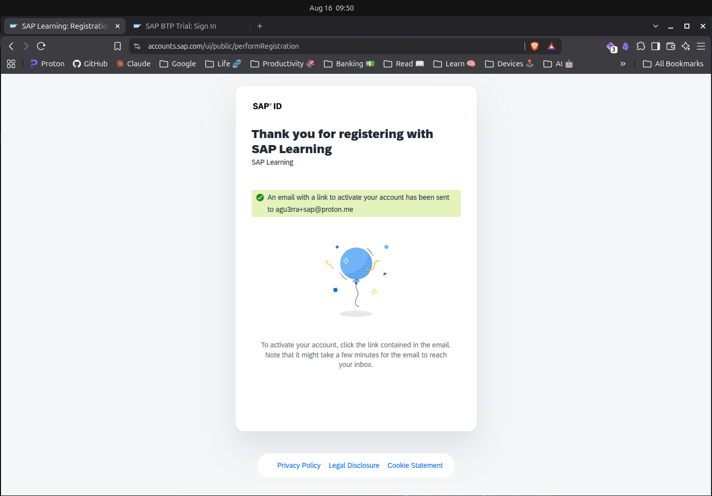
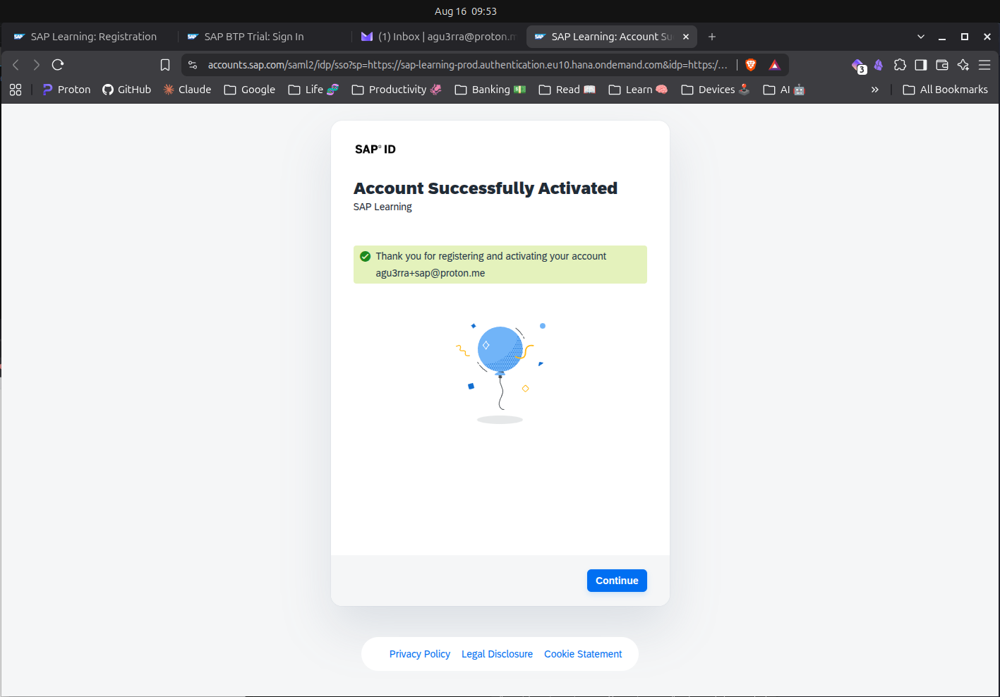
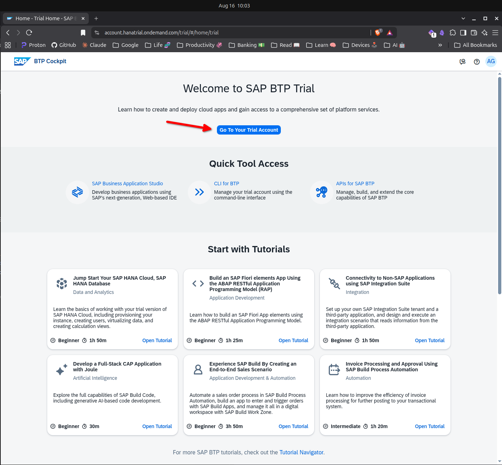
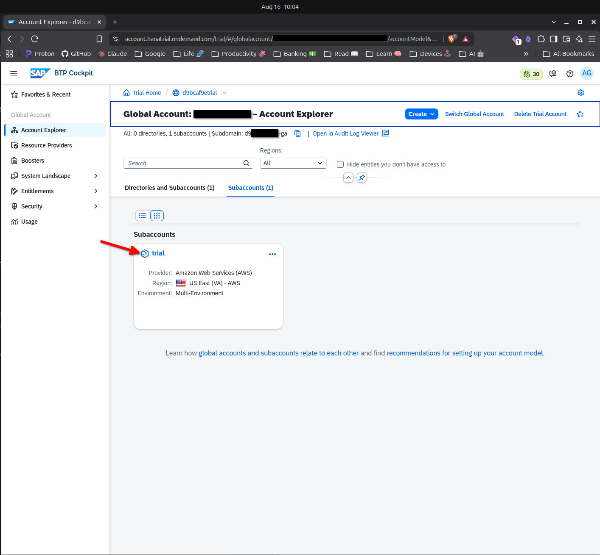
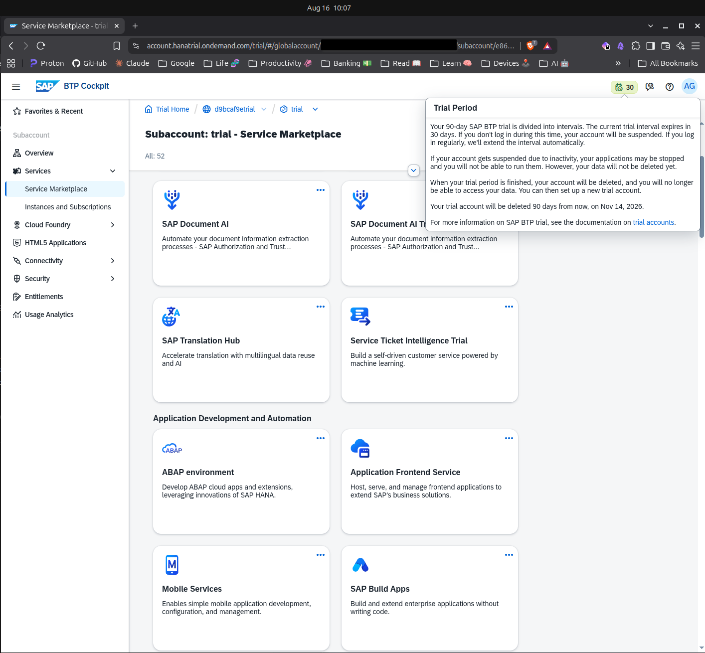

# SAP BTP Playground

!!! abstract "First published: 2026-08-16"

## In the old days
Barrier for learning SAP before and now

## SAP BTP to the rescue

### SAP Business Technology Platform
What is SAP BTP

### Creating an SAP ID

An SAP ID is the ...
https://learning.sap.com/?userlogin=true

=== "Registration" 
    

=== "Confirmation message"
    

=== "Confirmed"
    

### Creating a BTP Trial

Access [SAP BTP Trial](https://account.hanatrial.ondemand.com/trial/#/home/trial).
Complete the upgrade process by informing your phone and confirming the SMS code you'll receive.
Then, on the next page, select one of the available options for region and wait for provision to finish.

Once that happens, you should be able to see the main global account menu, then access the corresponding `trial` subaccount you've just provisioned.

??? info "Global vs. Subaccounts"
    Explain what they are.

=== "Region selection"
    
    
=== "Provisioning"
    

=== "Trial account"
    

=== "Subaccount"
    

## Navigating BTP Cockpit
Talk about trial duration and possible services to provision. Then continue with a sample service and access it.

??? question "What is Cloud Foundry?"
    Explain without too much fuss.

Notice the trial account is valid for up to 90 days before your playground is destroyed.
During that time, you can select a variety of SAP products and services to provision and learn through hand-on practice.

